# Strata LLM Console — English

[English](README.en.md) · [Español](README.es.md) · [Português](README.pt.md) · [Français](README.fr.md) · [Deutsch](README.de.md)

English is the default interface language and the reference documentation for Strata LLM Console.

## Engine origin

This console is an operational layer for the [official Strata inference engine](https://github.com/Niko1221/Strata). The engine repository is `https://github.com/Niko1221/Strata.git`. The console manages the catalog, runtime parameters, model lifecycle, network exposure, observability and updates around that engine.

## Main areas

- **Operate** — register, select, load, unload, stop and remove catalog entries; edit model parameters; analyze context and memory fit.
- **Observe** — inspect GPU/RAM metrics, historical performance, request traces, exposed reasoning, tool calls, token usage, latency and errors.
- **Connect** — keep the API on localhost, explicitly enable LAN access, configure Bearer authentication/CORS and start an encrypted tunnel.
- **System** — check the installed Strata version, compare upstream updates, detect compatible backends and configure UI preferences.

## API

- OpenAI gateway: `http://127.0.0.1:8090/v1`
- Control API: `http://127.0.0.1:8090/api`
- Remote access requires `Authorization: Bearer <console-token>`.
- The default bind address is loopback; LAN and CORS are opt-in.

## Optimizer

The optimizer evaluates hardware memory, requested context, KV quantization, expert cache, MTP/lookup settings, current configuration, historical observations and risk margins. It returns a recommendation, alternatives and confidence. Static analysis is labelled honestly and is not presented as a benchmark.

## Telegram

The allowlisted bot supports status, model selection, stop/unload confirmations, traces, errors, optimizer output, connection status and Strata update checks. New chats use English and can choose another locale from the language menu.

## Screenshots

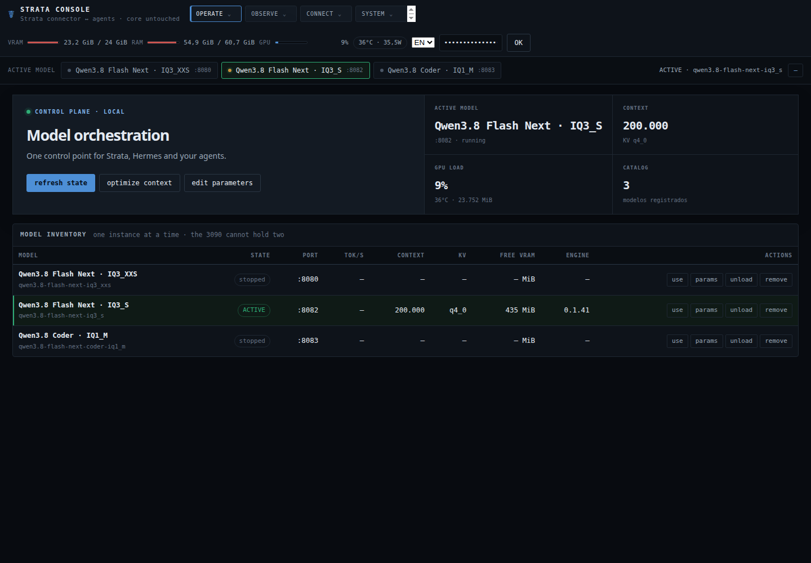
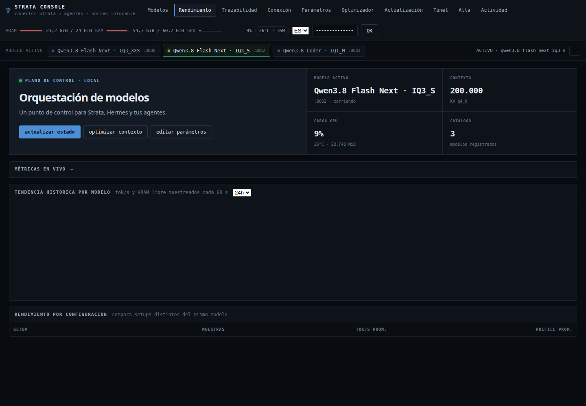
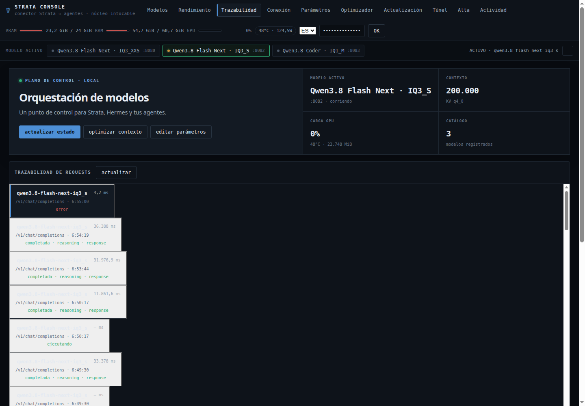
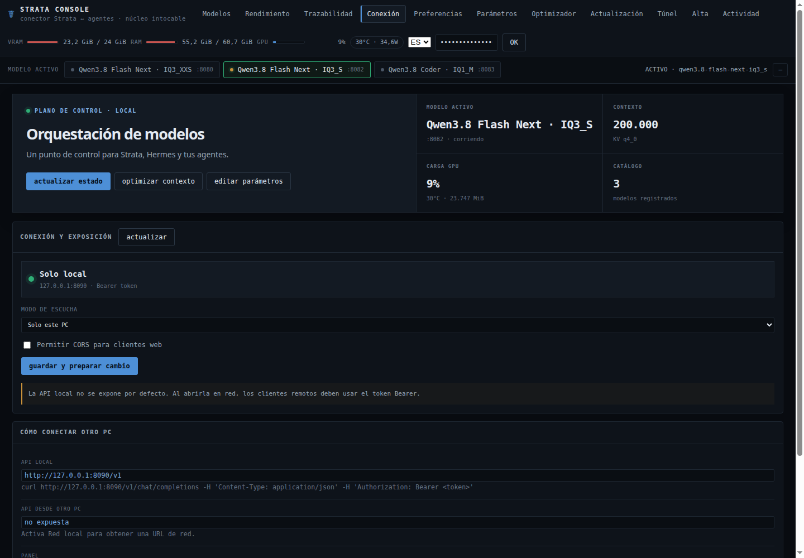
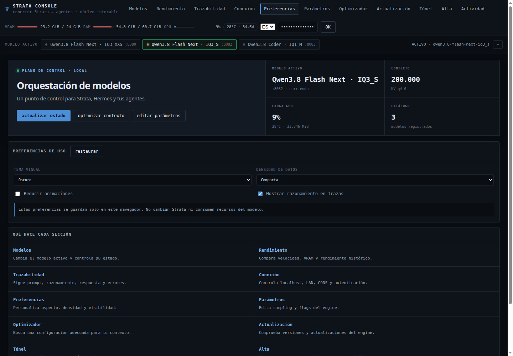
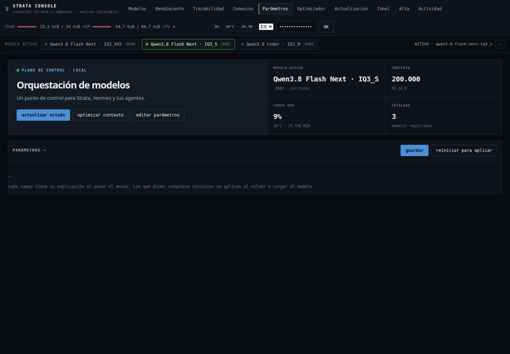
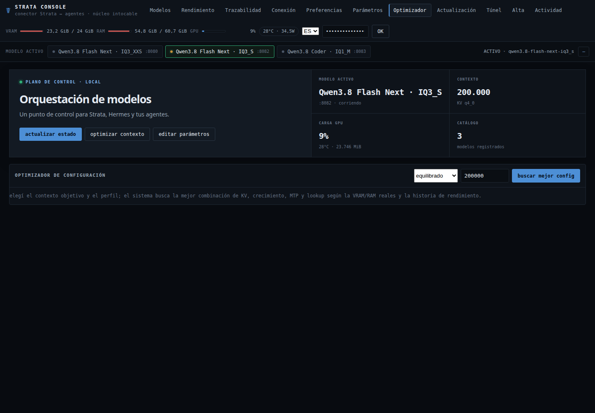
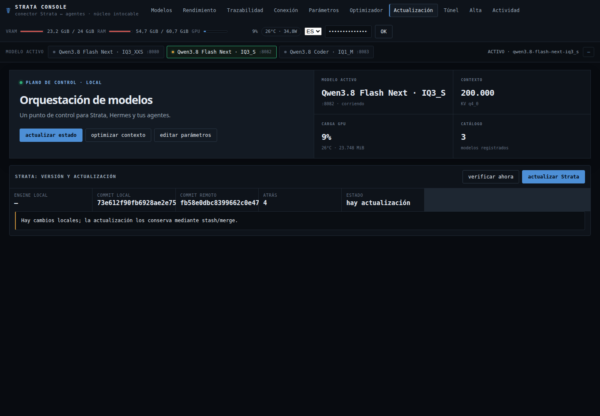
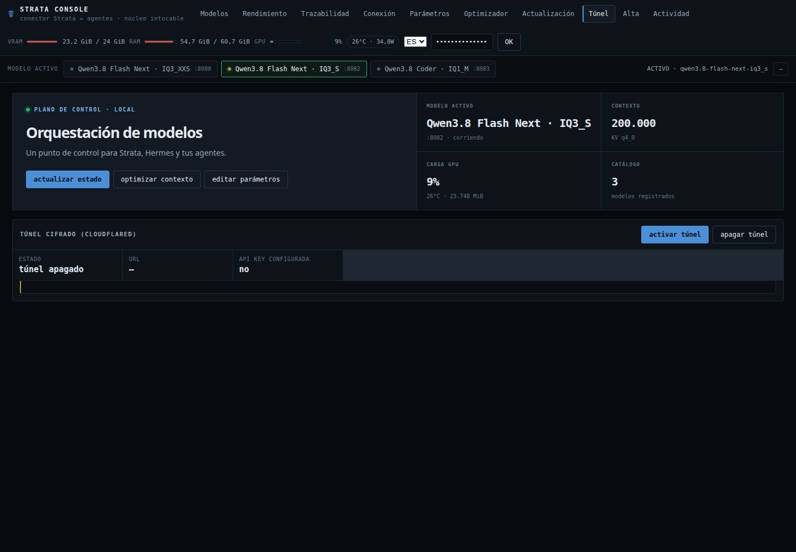
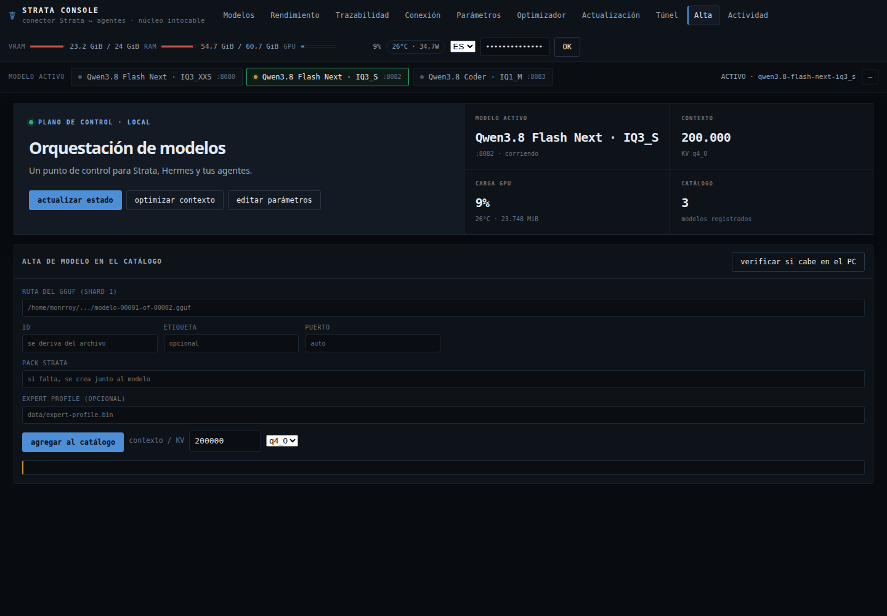
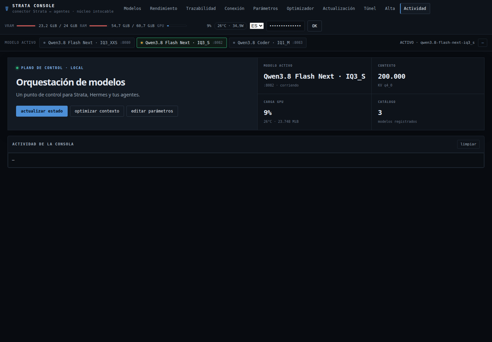

## Repository safety

Tokens, environment files, traces, logs, GGUF files, packs, binaries and machine-specific paths are excluded from Git. Removing a catalog entry never deletes the original model files.
