# Strata LLM Console — Español

[English](README.en.md) · [Español](README.es.md) · [Português](README.pt.md) · [Français](README.fr.md) · [Deutsch](README.de.md)

El inglés es el idioma inicial y la documentación de referencia de Strata LLM Console. El usuario puede cambiar el idioma desde el encabezado o Preferencias.

## Origen del motor

Esta consola es una capa operativa para el [motor oficial de inferencia Strata](https://github.com/Niko1221/Strata). El repositorio de origen es `https://github.com/Niko1221/Strata.git`. La consola administra el catálogo, los parámetros, el ciclo de vida, la exposición de red, la observabilidad y las actualizaciones.

## Áreas principales

- **Operar** — registrar, seleccionar, cargar, descargar, detener y quitar modelos del catálogo; editar parámetros; analizar memoria y contexto.
- **Observar** — revisar VRAM/RAM, rendimiento histórico, trazas, razonamiento expuesto por el motor, herramientas, tokens, latencia y errores.
- **Conectar** — mantener la API local, activar LAN de forma explícita, configurar Bearer/CORS y usar un túnel cifrado.
- **Sistema** — consultar la versión de Strata, revisar actualizaciones, inspeccionar las capacidades del motor Strata y personalizar la interfaz.

## API

- Gateway OpenAI: `http://127.0.0.1:8090/v1`
- API de control: `http://127.0.0.1:8090/api`
- El acceso remoto exige `Authorization: Bearer $STRATA_CONSOLE_TOKEN`.
- La dirección local es loopback; LAN y CORS requieren activación explícita.

## Optimizador

Combina memoria real de GPU/RAM, contexto solicitado, cuantización KV, caché de expertos, MTP/lookup, configuración vigente, historial y márgenes de riesgo. Devuelve recomendación, alternativas y confianza. El análisis estático se identifica como tal y no se presenta como benchmark.

## Telegram

El bot con lista permitida controla estado, selección de modelos, detención, descarga, confirmaciones, trazas, errores, optimización, conexión y actualizaciones de Strata. Los chats nuevos empiezan en inglés y pueden seleccionar otro idioma.

## Capturas

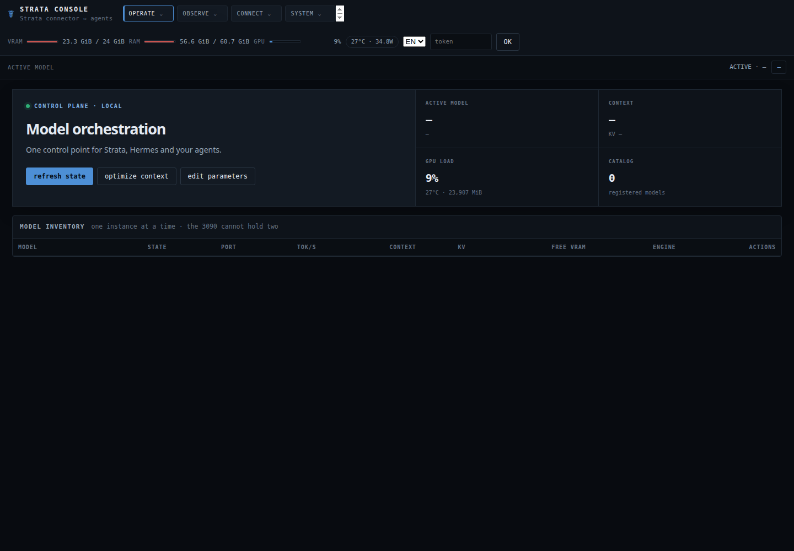
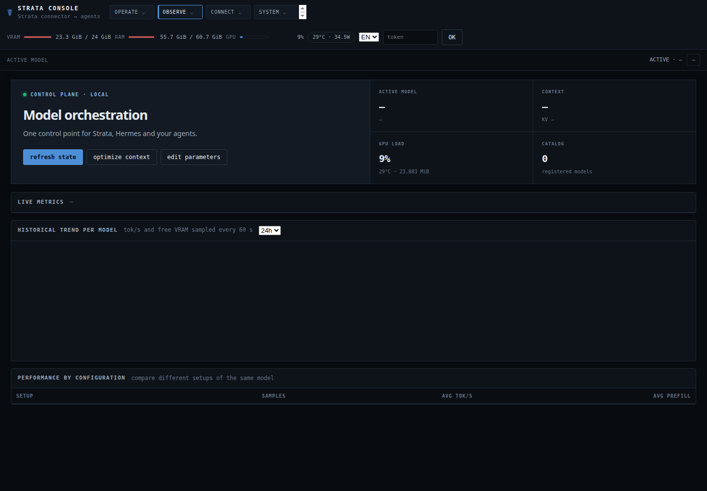
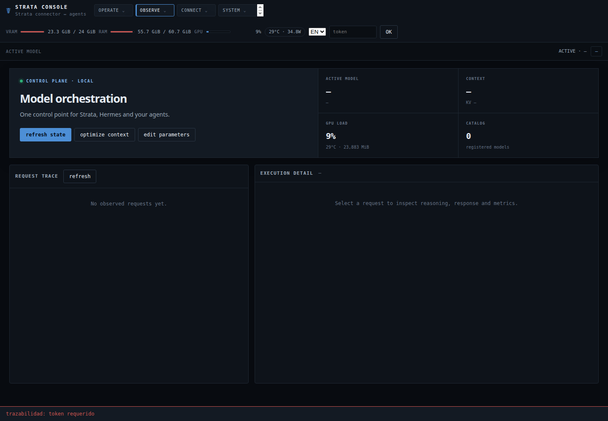
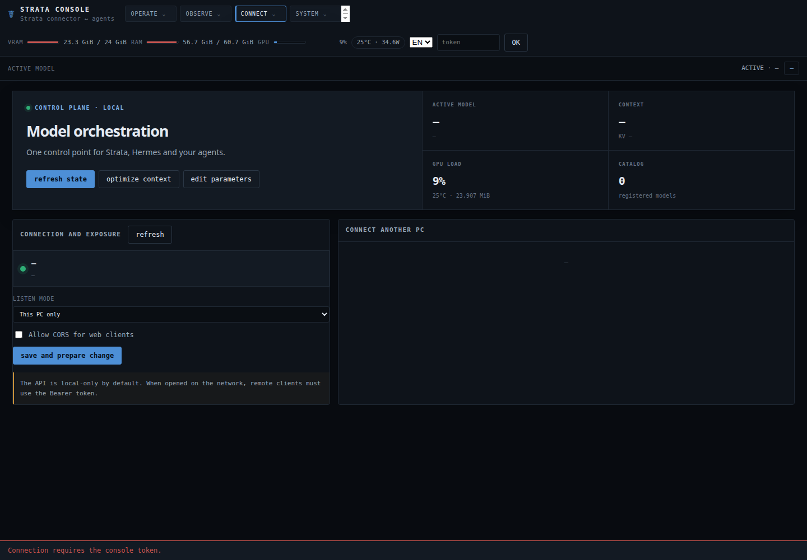
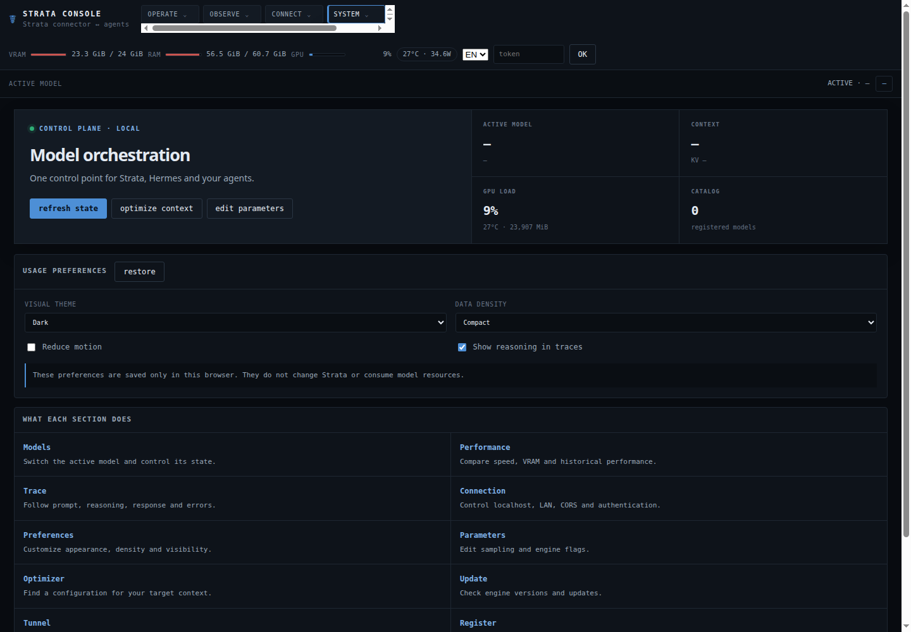
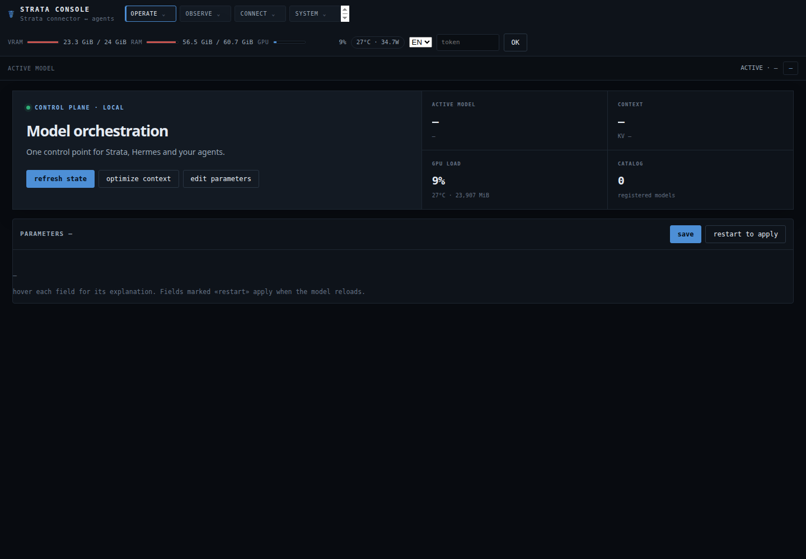
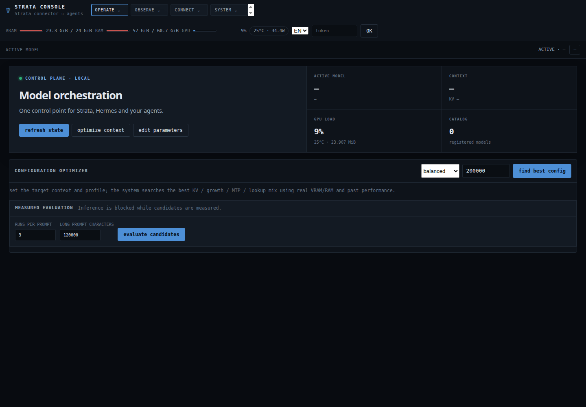
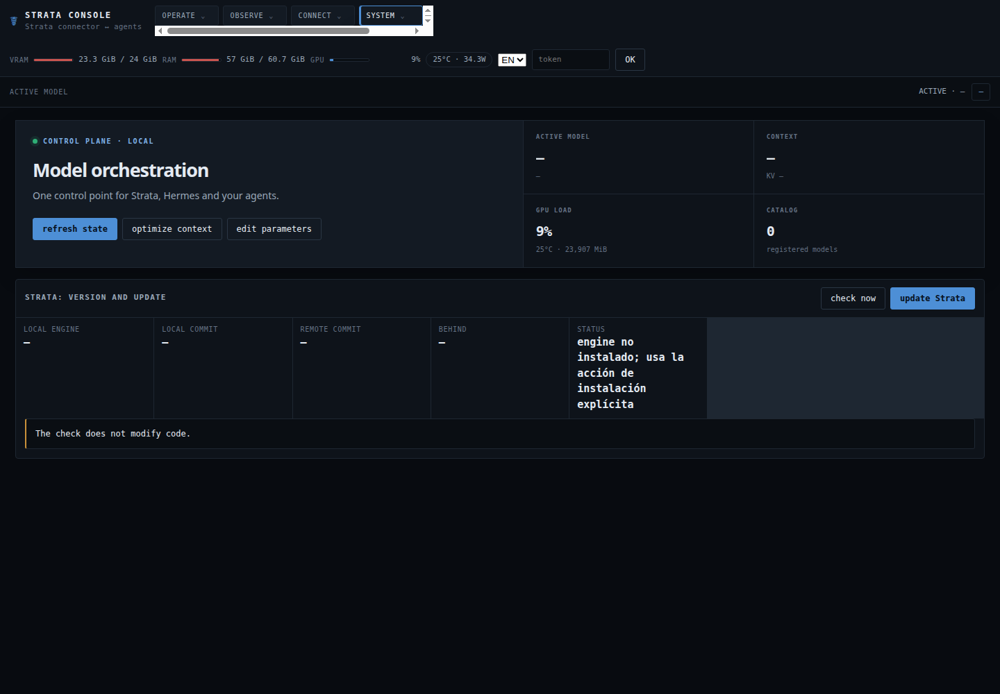
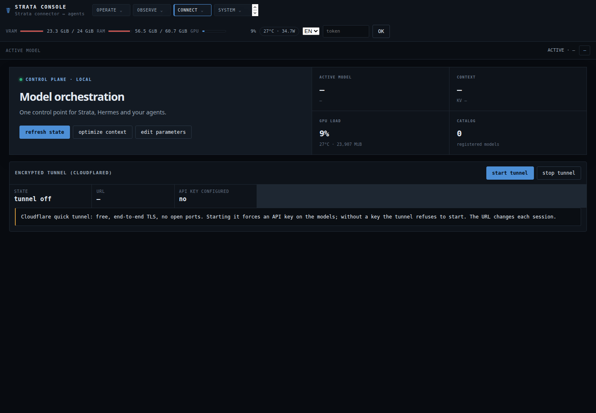
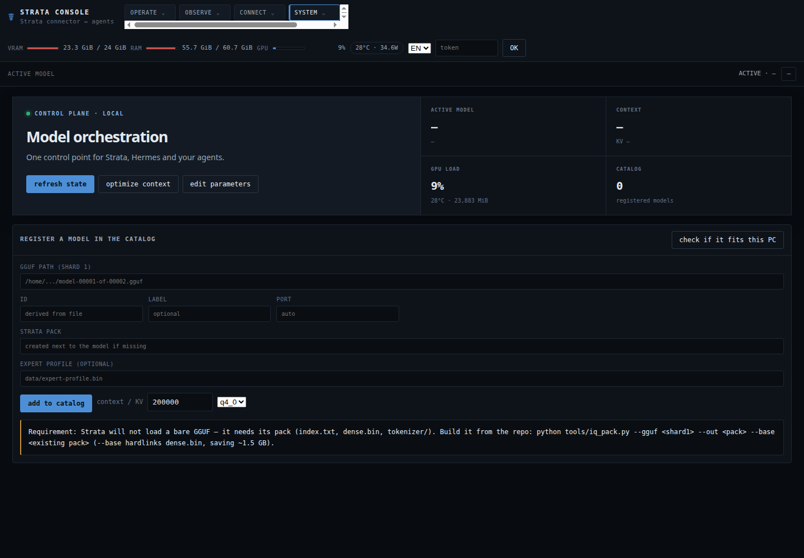
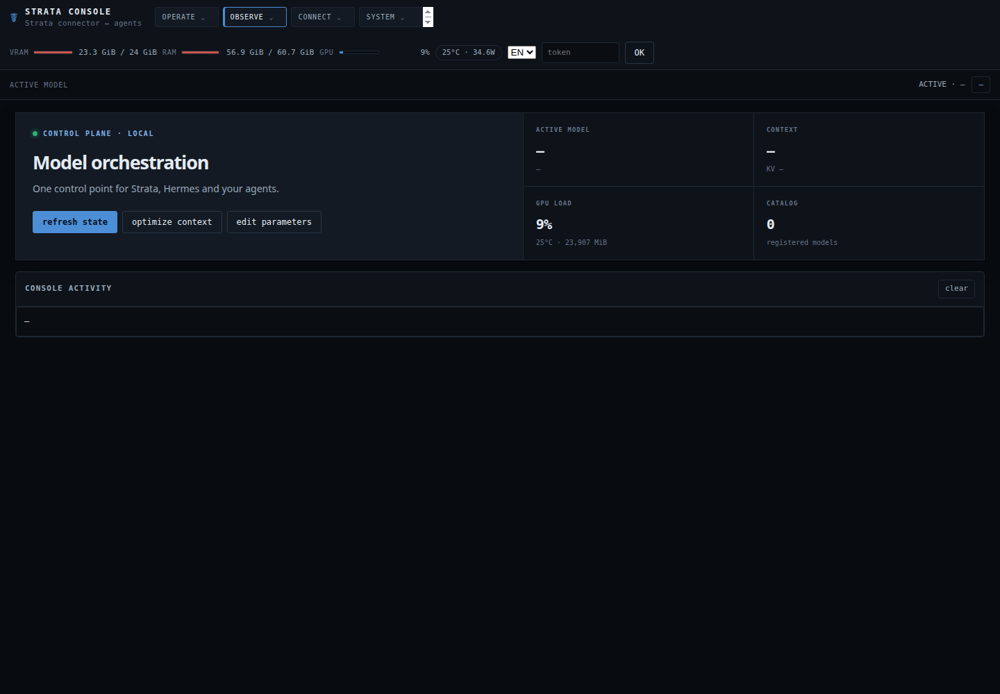

## Instalación en Linux

Después de publicar una versión, instala el paquete Linux para el usuario con:

```bash
curl -fsSL https://github.com/monrroyag/strata-llm-console/releases/latest/download/install-linux.sh | bash
```

El instalador verifica SHA-256, instala en `~/.local/share/strata-llm-console`, crea el comando en `~/.local/bin` y registra un servicio systemd de usuario cuando está disponible.

## Seguridad del repositorio

Los tokens, archivos de entorno, trazas, logs, GGUF, packs, binarios y rutas específicas del equipo quedan fuera de Git. Quitar un modelo del catálogo nunca elimina sus archivos originales.